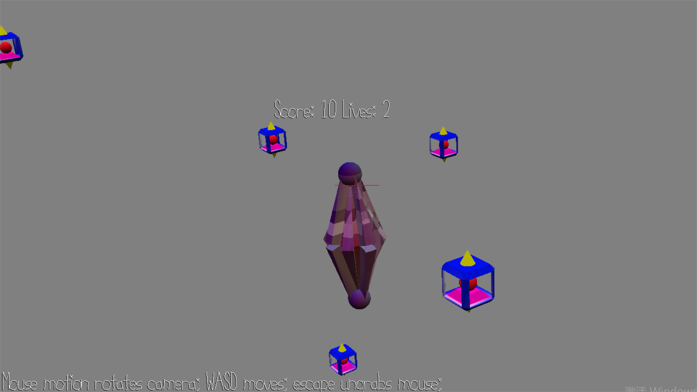

# Protect the Core

Author: Haoxi Zhang

Design: You need to change view to defend attack.

Screen Shot:

How To Play:

use WASD and mouse to change views. Protect the core. When you lose life, shader will change color.

Ref:

* Random Shader Code: http://amindforeverprogramming.blogspot.com/2013/07/random-floats-in-glsl-330.html

This game was built with [NEST](NEST.md).
